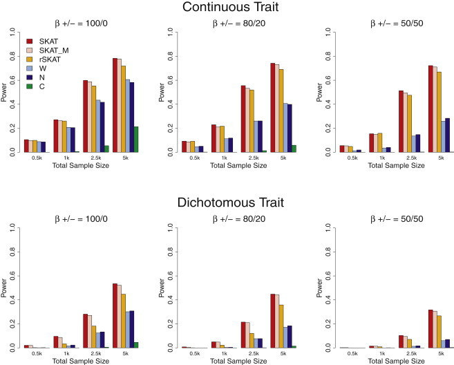
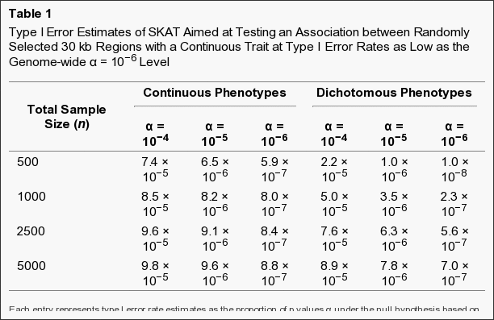
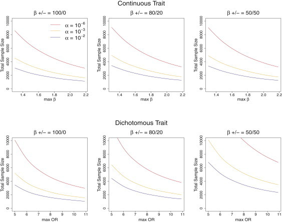
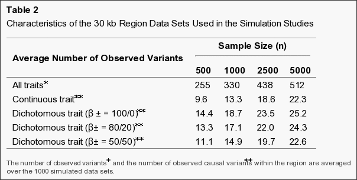
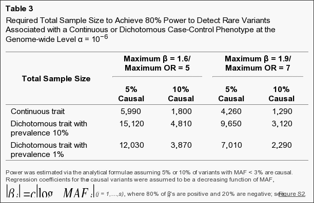
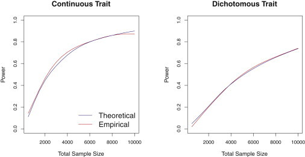

CB2 Journal Club
========================================================
Rare-Variant Association Testing for Sequencing Data with the **S**equence **K**ernel **A**ssociation **T**est
-------

SKAT
----
http://www.ncbi.nlm.nih.gov/pmc/articles/PMC3135811/   

PENHA EDS   
Jun 11 2015   

###### link to this presentation:   
###### https://goo.gl/DcagwF

<!---
Notes: Core Concepts
- Rare Variant
- Burden Test
- Significance by permutation
- Kernel Density estimation
- Kernel Association Test
- Definition of Thresholds
- Supervised test
- kernel machine regression
--->

First and Senior Authors
========================================================

Michael C. Wu
-------------
Assistant Member, Public Health Sciences Division, Fred Hutchinson Cancer 
Research Center
http://research.fhcrc.org/wu/en/group-members/michael-wu.html
***
   
Xihong lin   
----------
Coordinating director of the Program of Quantitative Genomics of Harvard School 
of Public Heath
http://www.hsph.harvard.edu/xihong-lin/   

Quite popular paper
========================================================
The article is Cited by the 332 Articles on pmc:
http://www.ncbi.nlm.nih.gov/pmc/articles/PMC3135811/citedby/   

Why?
========================================================
- Association of rare variants with complex traits
- Limited power of single-marker association analysis for rare variants
  - unless samples sizes or effects sizes are very large

Rare Variants
========================================================
- Alleles with frequency less than 1% - 5%
- can play key roles, but
  - they are rare

Logical Step: Burden Tests
========================================================
- collapse or summarize multiple variants
- region based
- Examples:
  - CAST - Cohort Allelic Sum Test
  - WST - Weighted sim test

Limitations of Burden Tests
========================================================
- assumes
  - unidirectional effects
  - magnitude
- most of the time, this does not hold true
- collapsing produces noise

Limitations of Burden Tests (cont)
========================================================
- Permutations are used:
  - for estimation of threshold for collapsing
  - p values
- hard covariate adjustment


Permutations tests
========================================================
All possible values of a statistic under rearrangements of the observed data.
### computationally expensive especially on whole genome scale
- Big-O Complexity
  - O(n!)

Non-burden test
========================================================
- C-alfa
  - compares actual vs expected variance of distribuition of alleles
  - improved power
    - principally when effects are in different directions
  - but don't permit easy covariate adjustment


Sequence Kernel Association Test
========================================================
- Supervised
- Flexible
- Computationally efficient
- region based
- continuous or dichotomous traits
- adjusting for covariates
- sample size and power

<!---  
Notes: this can be quite triky becasuse 
there are a lot of concepts on this slide 
--->

Bonus
========================================================
- provide and test estimation of sample size and statistical power


Methods
========================================================
- Regions can be defined by genes (in candidate-gene or whole-exome studies) 
or moving windows across the genome (in whole-genome studies). 
- For each region, SKAT analytically calculates a p value for association while
adjust- ing for covariates.
- Additive genetic model

SKAT as superset or subset
========================================================
- dichotomous
- no covariants

  "SKAT can be seen as a generalized C-alpha test that does not require 
  permutation but ***calculates the p value analytically***, allows for covariate 
  adjust- ment, and accommodates either dichotomous or continuous 
  phenotypes"
        
SKAT as superset or subset
========================================================

  "Because SKAT under flat weights is also equivalent to the kernel machine 
  regression test and because the kernel machine regression test is in turn 
  related to the SSU test, it follows transitively that SKAT under 
  **flat weights**, the kernel machine regression test, the SSU test, and 
  the C-alpha test are all equivalent and special cases of SKAT"
  


Methods - Simulation of the Type I Error
========================================================

Methods - Statistical Power
========================================================

Methods - Power and Sample-Size Estimation
========================================================


Power Comparison of SKAT and burden tests
========================================================


Type I error Estimates
========================================================


Sample Size Required for 80% Power
========================================================


30 kb Region Data Sets
========================================================


Sample Size to Achieve 80% power
========================================================


Power Comparison Based on Simulation and Analytic Estimation
========================================================



SKAT package
========================================================

http://cran.r-project.org/web/packages/SKAT/index.html

```r
require("SKAT")
```

```r
require("knitr")
```

SKAT example
========================================================
Compute the P-value of SKAT with default Beta(1,25) Weights without covariates

```r
data(SKAT.example)
attach(SKAT.example)
str(SKAT.example)
```

```
List of 4
 $ Z  : int [1:2000, 1:67] 0 0 0 0 0 0 0 0 0 0 ...
 $ X  : num [1:2000, 1:2] 0 0 0 0 0 0 0 0 0 0 ...
 $ y.c: num [1:2000, 1] 0.4929 -1.2148 0.0872 -0.382 1.0854 ...
 $ y.b: num [1:2000] 1 0 0 0 1 1 0 1 1 0 ...
```

SKAT example - Data Description
========================================================
- Z - a numeric genotype matrix of 2000 individuals and 67 SNPs.  Each row represents a different
individual, and each column represents a different SNP marker.
- X - a numeric matrix of 2 covariates.
- y.c - a numeric vector of continuous phenotypes.
- y.b - a numeric vector of binary phenotypes.

```r
names(SKAT.example)
```

```
[1] "Z"   "X"   "y.c" "y.b"
```

SKAT example - Z - genotype matrix
========================================================

```r
kable(as.data.frame(SKAT.example$Z[1:10,1:10]))
```


| V1| V2| V3| V4| V5| V6| V7| V8| V9| V10|
|--:|--:|--:|--:|--:|--:|--:|--:|--:|---:|
|  0|  0|  0|  0|  2|  0|  0|  0|  0|   0|
|  0|  0|  0|  0|  1|  0|  0|  0|  0|   0|
|  0|  0|  0|  0|  0|  1|  0|  0|  0|   0|
|  0|  0|  0|  0|  0|  0|  0|  0|  0|   0|
|  0|  0|  0|  0|  1|  0|  0|  0|  0|   0|
|  0|  0|  0|  0|  0|  0|  0|  0|  0|   0|
|  0|  0|  0|  0|  1|  0|  0|  0|  0|   0|
|  0|  0|  0|  0|  0|  0|  0|  0|  0|   0|
|  0|  0|  0|  0|  0|  1|  0|  0|  0|   0|
|  0|  0|  0|  0|  1|  0|  0|  0|  0|   0|

SKAT example - X - 2 covariates.
========================================================

```r
kable(as.data.frame(SKAT.example$X[1:10, ]))
```


| V1|         V2|
|--:|----------:|
|  0| -0.1146409|
|  0| -1.0205783|
|  0| -0.2970513|
|  0|  0.1681500|
|  0|  1.4198723|
|  0| -0.0995251|
|  0| -0.8182970|
|  0| -0.4693022|
|  0|  0.5750450|
|  0| -1.8717451|

SKAT example - y.c - a numeric vector of continuous phenotypes.
========================================================

```r
kable(as.data.frame(SKAT.example$y.c[1:10]))
```


| SKAT.example$y.c[1:10]|
|----------------------:|
|              0.4928898|
|             -1.2147699|
|              0.0871747|
|             -0.3819833|
|              1.0854120|
|              1.4412798|
|             -0.4324848|
|              1.4329668|
|              0.7306414|
|             -0.4391597|

SKAT example - y.b - a numeric vector of binary phenotypes.
========================================================

```r
kable(as.data.frame(SKAT.example$y.b[1:10]))
```


| SKAT.example$y.b[1:10]|
|----------------------:|
|                      1|
|                      0|
|                      0|
|                      0|
|                      1|
|                      1|
|                      0|
|                      1|
|                      1|
|                      0|

SKAT example - continuous trait
========================================================

```r
obj<-SKAT_Null_Model(y.c ~ 1, out_type="C")
str(SKAT(Z, obj))
```

```
List of 6
 $ p.value           : num 0.0187
 $ p.value.resampling: NULL
 $ Test.Type         : chr "davies"
 $ Q                 : num [1, 1] 234804
 $ param             :List of 4
  ..$ liu_pval     : num 0.0199
  ..$ Is_Converged : num 1
  ..$ n.marker     : int 67
  ..$ n.marker.test: int 67
 $ pval.zero.msg     : NULL
 - attr(*, "class")= chr "SKAT_OUT"
```
SKAT example - continuous trait - pvalue
========================================================

```r
SKAT(Z, obj)$p.value
```

```
[1] 0.01874576
```

SKAT example -  dichotomous trait
========================================================

```r
obj<-SKAT_Null_Model(y.b ~ 1, out_type="D")
SKAT(Z, obj)$p.value
```

```
[1] 0.1145585
```
